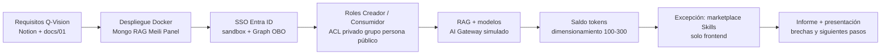

# Laboratorio LibreChat — respuestas para plantilla de seguimiento

**Uso:** copiar cada sección a `plantillaLaboratorio.md` / Word.  
**Fuentes (prioridad):** presentación `LibreChat en Q-Vision · Resumen del laboratorio.html` → requisitos `docs/01-`* y config `docs/02-`* → dimensionamiento `docs/03-*` → `notion-laboratoriotext.md` → `CHANGELOG.md` / `BRECHAS.md` (fase inicial; algunos puntos ya se cerraron después).

**Cobertura vs. el enunciado original (Notion)**

| Actividad del enunciado                                                                   | En este laboratorio | Nota al pasar a Word                                                                                                    |
| ----------------------------------------------------------------------------------------- | ------------------- | ----------------------------------------------------------------------------------------------------------------------- |
| Evaluación funcional de LibreChat (casos Q-Vision)                                        | **Sí**              | SSO, roles, marketplace/ACL, RAG, gateway, saldo                                                                        |
| Evaluación funcional de Microsoft Copilot / Copilot Studio                                | **No**              | No hay evidencias en las fuentes; no inventar paridad ni calidad                                                        |
| Matriz de paridad LibreChat vs Copilot                                                    | **No**              | Solo se documenta el lado LibreChat                                                                                     |
| Modelación de costos Copilot (licencias, créditos Studio) vs LibreChat (tokens + hosting) | **Parcial**         | Hay dimensionamiento e infra de LibreChat; no hay modelo de licenciamiento Microsoft ni punto de equilibrio entre ambas |
| Recomendación “una, la otra o híbrido”                                                    | **No**              | El cierre del HTML es “LibreChat esencial funciona”; no hay veredicto vs Copilot                                        |

---

## 1. Introducción

### 1.1 Título del laboratorio

Laboratorio comparativo LibreChat vs. Microsoft Copilot como plataforma de asistente de IA organizacional: capacidades, beneficios y costos para Q-Vision.  
**(Únicamente enfocado en LibreChat.)**

### 1.2 Descripción breve

Laboratorio de **configuración y validación** de LibreChat como plataforma de IA organizacional para Q-Vision: instancia local (Docker Compose) con MongoDB, búsqueda, RAG, panel de administración, SSO Microsoft Entra ID y un AI Gateway simulado como única puerta de salida a modelos.

**Dónde inicia:** requisitos funcionales del área (`docs/01-Requisitos-LibreChat-QVision.md`) y el enunciado de Notion (casos de uso: RAG, agentes con skills/MCP, asistencia a colaboradores, control de acceso por rol).  
**Dónde termina:** instancia verificada en infraestructura propia (chat, datos y permisos en casa), con evidencia de qué se logra por configuración, qué exige código y qué se dejó apagado a propósito. No incluye Copilot, no incluye tenant productivo `@qvision.us`, no incluye HA ni migración de datos reales.

**Herramientas:** Docker Compose, LibreChat (fork acotado), Azure Entra ID (tenant sandbox Microsoft 365 Developer), MongoDB, RAG API + pgvector, Meilisearch, AI Gateway simulado (`endpoints.custom`), Admin Panel. Una excepción de código acordada: marketplace de Skills en `/skills` (solo UI, ~1 h).

**Proceso / área cliente:** Innovación / gobierno de IA (sponsor en requisitos: Jorge Rubio). El laboratorio no es el fin: es insumo para decidir el **gobierno de IA de la organización** (políticas, pautas de uso, si LibreChat puede sostenerlo, si haría falta Copilot o un híbrido). El lado Copilot de esa decisión **no se ejecutó** en las fuentes de este entregable.

**Aspectos a mencionar en la descripción:**

- Producto por defecto + configuración, para recibir actualizaciones; excepción: Marketplace de Skills.
- LibreChat cubre **agentes del lado servidor** (tools, APIs, archivos del servidor). **No** cubre agentes tipo Cowork sobre el PC del usuario (haría falta MCP local o túnel).
- SSO validado en sandbox; Infra debe repetir App registration y consentimiento en el tenant real (ticket estimado 3+ días). Sin cambios extra en LibreChat.
- Code Interpreter **deshabilitado por decisión** (riesgo, infra extra), no como fallo de la demo.

---

## 2. Objetivos del laboratorio

*(Alineados a Notion, recortados al alcance real: solo LibreChat.)*

1. **Validar casos de uso Q-Vision en LibreChat:** autenticación empresarial, grupos, roles Creador/Consumidor, visibilidad de agentes/MCP/skills, RAG sobre conocimiento propio, y enrutamiento por AI Gateway.
2. **Separar capacidades nativas (configuración) de las que piden código:** documentar brechas (cuota por departamento, rol automático por grupo, marketplace unificado, Code Interpreter, Cowork).
3. **Dimensionar alojamiento y operación** para 100 / 200 / 300 usuarios registrados (insumo de costos de infra; no licenciamiento de Copilot ni proyección de tokens de producción).
4. **Dejar una instancia demostrable** (varios usuarios, vistas distintas por rol) como base para un comparativo posterior con Microsoft Copilot.

**Objetivos del enunciado que no se pueden marcar como cumplidos aquí:** paridad frente a Copilot Studio / M365 Copilot; modelo de costos con punto de equilibrio entre ambas plataformas; recomendación de adopción una / otra / híbrida.

---

## 3. Planteamiento del laboratorio

¿Puede LibreChat, autoalojado y gobernado por Q-Vision (SSO Microsoft, roles, catálogo por equipo, cuota de tokens, RAG y salida única a modelos), sostener el uso organizacional de agentes de IA **sin modificar el producto**, o hace falta desarrollo y/o el ecosistema Copilot?

Forma expositiva: se desplegó y midió LibreChat como si fuera un despliegue multi-usuario realista. Lo que no existe por configuración se anotó como brecha o como evolución (fase 2), no se “inventó” en código salvo el marketplace de Skills.

### 3.1 Proceso de desarrollo del laboratorio

Entradas: requisitos Q-Vision, stack Docker, tenant Entra sandbox, claves de modelo (OpenAI/Anthropic) y gateway simulado.  
Actividades: despliegue → identidad → roles y ACL → catálogo y RAG → saldo y gateway → dimensionamiento → excepción UI Skills → cierre.  
Salidas: instancia local verificada, presentación de resumen, este informe; pendientes explícitos (Copilot, tenant real, desarrollos acotados).

**Herramientas en el flujo:** Docker Desktop (Windows), Azure Portal, Admin Panel (`:3000`), UI LibreChat (`:3080`), MongoDB, `librechat.yaml` / `.env` / `docker-compose.override.yml`.

---

## 4. Parámetros iniciales o entradas

| Entrada                    | Condición en el laboratorio                                                                                                            |
| -------------------------- | -------------------------------------------------------------------------------------------------------------------------------------- |
| Ambiente                   | Local, Docker Compose, no productivo. Demo sirve para configurar; no es tamaño de 100 usuarios.                                        |
| Identidad                  | Tenant **sandbox** Microsoft 365 Developer (no `@qvision.us`). Consentimiento admin en tenant real requiere Infra.                     |
| Datos de conocimiento      | Documento de prueba `lab/qvision-conocimiento.txt` (dato controlado: código, responsable, ubicación, vigencia). Sin corpus productivo. |
| Modelos                    | APIs externas (OpenAI, Anthropic) y endpoint custom al gateway simulado. Sin GPU; el modelo no corre en el servidor.                   |
| Usuarios de prueba         | Varias cuentas OpenID + admin local de respaldo. Un usuario = un rol (no se combinan).                                                 |
| Hipótesis inicial de forma | “Todo por yaml/env/panel, sin código”. Se mantuvo salvo marketplace de Skills.                                                         |
| Fuera de entrada           | Copilot, SharePoint/OneDrive (opcional no validado), HA, Redis/schedules, ClickHouse/code interpreter.                                 |

En reposo se midieron **siete servicios** (~**0,85 GB** RAM, **< 4 %** CPU), el 2026-09-24, sin carga de usuarios.

---

## 5. Recursos

### 5.1 Humanos

| Rol en el laboratorio            | Función                                                                    | Para replicar / producir                                                       |
| -------------------------------- | -------------------------------------------------------------------------- | ------------------------------------------------------------------------------ |
| Ejecutor técnico del laboratorio | Compose, `.env`, yaml, Entra, pruebas de UI y Mongo                        | Perfil que arma y demuestra la instancia                                       |
| Administrador funcional          | Roles, miembros, catálogo, documentos, cuotas a mano                       | Una persona en operación (no escala 1:1 con 100→300 usuarios)                  |
| Infraestructura                  | App registration, consentimiento admin, TLS/DNS en prod, parches y backups | Horas al mes + ticket Entra en tenant real                                     |
| Sponsor / área cliente           | Alcance de gobierno de IA, decisión Copilot vs LibreChat vs híbrido        | Jorge Rubio / Innovación (según requisitos); **comparativo Copilot pendiente** |

### 5.2 Técnicos

**No pegar contraseñas ni secretos en Word.** Viven en `.env` (gitignored). En la tabla: “ver gestor de secretos / `.env` local”.

| Nombre herramienta                    | Link de acceso                                          | Usuario                                                      | Contraseña                                                             |
| ------------------------------------- | ------------------------------------------------------- | ------------------------------------------------------------ | ---------------------------------------------------------------------- |
| LibreChat (UI)                        | Local: `http://localhost:3080`                          | SSO Microsoft (cuentas del tenant sandbox)                   | Cuenta Microsoft; no hay password de LibreChat en SSO                  |
| Admin Panel                           | Local: `http://localhost:3000`                          | Cuenta `ADMIN` (SSO promovida **o** admin local de respaldo) | SSO: Microsoft. Local: solo en `.env` / nota interna, **no versionar** |
| API health                            | `http://localhost:3080/health`                          | —                                                            | —                                                                      |
| Azure Portal (App registration Entra) | `https://portal.azure.com`                              | Admin del tenant **sandbox**                                 | Cuenta Microsoft del laboratorio                                       |
| MongoDB (contenedor)                  | Interno Compose (`chat-mongodb`); no exponer a Internet | Según `.env`                                                 | Según `.env`                                                           |
| RAG API                               | Interno `http://rag_api:8000` (`/health` → UP)          | —                                                            | —                                                                      |
| AI Gateway simulado                   | Interno `http://ai-gateway:4000/v1`                     | Clave `GATEWAY_API_KEY`                                      | Solo `.env`                                                            |
| Documentación LibreChat               | `https://www.librechat.ai/docs`                         | —                                                            | —                                                                      |

Cuentas de evidencia (CHANGELOG; **no son producción Q-Vision**): p. ej. `ad102131@outlook.com` como `ADMIN`; `admin.lab@qvision.local` admin local; usuarios de prueba Consumidor / grupo Entra (`dev1@…`, `rh@…`). Rotar o no reutilizar en entregables públicos.

### 5.3 Tecnológicos (infraestructura)

**Laboratorio (medido):** Docker Desktop en Windows; RAM visible para contenedores ~7,6 GB. Stack: `api` (LibreChat), `admin-panel`, `ai-gateway`, `mongodb`, `meilisearch`, `vectordb`, `rag_api`. Puertos típicos: **3080** chat, **3000** panel.

**Recomendación de hosting (presentación +** `docs/03`**), modelos por API, sin GPU:**

|                                             | 100 personas | 200 personas | 300 personas |
| ------------------------------------------- | ------------ | ------------ | ------------ |
| Procesador                                  | 4 núcleos    | 8 núcleos    | 8 núcleos    |
| Memoria                                     | 16 GB        | 24 GB        | 32 GB        |
| Disco SSD                                   | 100 GB       | 200 GB       | 300 GB       |
| GPU                                         | No           | No           | No           |
| Respuestas a la vez (pico ~20 % conectados) | ~8           | ~15          | ~25          |

Una sola máquina **8 núcleos / 32 GB / 300 GB** cubre los tres tamaños si el pico se mantiene cerca de ~25 generaciones. Ampliar si hay 40–50 respuestas sostenidas o si adjuntos/vectores llenan disco. GPU solo si el modelo corre dentro de Q-Vision.

**Producción (pendiente de Infra, no del código):** repetir App registration + consentimiento en tenant `@qvision.us`; proxy TLS; no usar `localhost` como redirect.

### 5.4 Metodológicos (opcional)

- Validación por **configuración primero**; código solo con excepción documentada (Skills UI).
- Pruebas de **punta a punta** en UI (ACL en 4 visibilidades; RAG con dato exacto; gateway HTTP 200).
- Tenant sandbox cuando el consentimiento en Q-Vision no cabía en el plazo.
- Bitácora `CHANGELOG.md` / `BRECHAS.md` (útil para SSO, saldo, RAG; **desactualizada** respecto al cierre: p. ej. marketplace Skills ya no es brecha de “no hay vista”; Graph OBO ya está resuelto).

---

## 6. Descripción del proceso realizado

Réplica resumida (detalle operativo en `docs/02` y CHANGELOG):

1. **Despliegue:** `.env` desde ejemplo; `docker compose up -d`; health API, Mongo, RAG. Montar `librechat.yaml` (exige `version`, p. ej. `1.3.16`) vía override.
2. **Branding / multi-usuario:** instancia pensada como org, no chat personal (título, varios usuarios).
3. **SSO Entra:** App registration, redirect OIDC, scopes `openid profile email offline_access` + API propia `access_as_user`; Graph para grupos. Sin `offline_access` se pierde el refresh. OpenID **no** hace ADMIN a la primera cuenta: promover a mano o `OPENID_ADMIN_ROLE`; dejar admin local de respaldo.
4. **Roles en el panel (no en yaml):** crear **Creador** (crear + compartir equipo; `SHARE_PUBLIC` apagado a propósito) y **Consumidor** (solo usar). Asignar miembros: **un usuario, un rol** (reemplaza USER/ADMIN). El USER de sistema **sigue pudiendo crear** hasta asignarle Consumidor.
5. **ACL / catálogo:** compartir recurso privado / grupo Entra / persona / público; verificar marketplace del otro usuario. Skill marketplace Q-Vision: grid en `/skills` (fork UI).
6. **RAG:** subir `.txt`; Claude respondió con dato de control. GPT-5/4o rechazaron `text/plain` como `file`; mitigación `fileConfig.defaultLLMDeliveryPath` y **volver a subir**. PDF nativo al proveedor.
7. **Saldo:** `balance.enabled`, `startBalance` 20.000. Misma bolsa `tokenCredits` para OpenAI y Anthropic (20.000 → **14.066,5** en la prueba de dos chats).
8. **Gateway:** `endpoints.custom` → contenedor interno; UI y contenedor `POST /v1/chat/completions` 200 con prefijo `[AI-Gateway-QVision]`.
9. **Code Interpreter:** no montar ClickHouse; Run Code falla; documentar como **decisión de seguridad**.
10. **Dimensionamiento:** `docker stats` en reposo + supuestos 20 % concurrente → tablas 100/200/300.
11. **Cierre:** presentación HTML; Infra en tenant real; gateway real (LiteLLM/Portkey/propio) para costos y logs (p. ej. Langfuse); revisar *thinking* por defecto en Claude (más tokens).

---

## 7. Resultados obtenidos

*(Un resultado por objetivo de la sección 2.)*

### Objetivo 1 — Casos de uso Q-Vision en LibreChat

**Resultado:** la plataforma esencial **funciona** en infraestructura propia.

| Caso (presentación / requisitos)                   | Resultado                                                                                       |
| -------------------------------------------------- | ----------------------------------------------------------------------------------------------- |
| SSO Microsoft y grupos Graph                       | Sí (sandbox). Producción = repetir Entra, no cambiar LibreChat                                  |
| Creador vs Consumidor                              | Sí. Consumidor no crea; Creador comparte con equipo y no publica a toda la empresa (por diseño) |
| Privado / grupo / persona / público                | Sí                                                                                              |
| Marketing usa agente público                       | Sí                                                                                              |
| RH Consumidor intenta crear                        | Bloqueado                                                                                       |
| Admin retira contenido                             | Sí                                                                                              |
| Preguntar a documento interno (RAG)                | Sí (dato exacto en prueba Claude)                                                               |
| AI Gateway como salida única                       | Sí (simulado)                                                                                   |
| Saldo por persona, varios proveedores              | Una sola bolsa                                                                                  |
| Agentes tipo Cowork en el PC                       | **No** (alcance)                                                                                |
| Marketplace único Agentes/Skills/MCP/Tools en tabs | **No** nativo; Skills y agentes en vistas separadas; MCP/tools en el builder                    |

### Objetivo 2 — Configuración vs código

**Resultado:**

| Mejora                                | Hoy                                   | Si se desarrolla                                      |
| ------------------------------------- | ------------------------------------- | ----------------------------------------------------- |
| Perfil según grupo Entra              | A mano al entrar                      | Grupo Devs/RH → Creador/Consumidor solo               |
| Combinar perfiles                     | Un perfil por persona                 | Cambiar persistencia del rol                          |
| Cuota al entrar al área               | 15.000 / 40.000 **persona a persona** | El grupo fija el saldo al login (cambio acotado)      |
| Logs centrales / bolsa departamental  | No nativo en LibreChat                | AI Gateway + Langfuse (sin tocar LibreChat)           |
| Marketplace Skills listado            | Resuelto en fork UI                   | Marketplace unificado de 4 tipos: no hecho            |
| Code Interpreter / skills con scripts | Apagado                               | Peligroso; infra sandbox; no recomendado en el cierre |

**Sin código (operable ya):** cargar saldos, modelos por departamento, publicar/compartir/retirar, sumar proveedores detrás del gateway, bases documentales por área.

### Objetivo 3 — Dimensionamiento

**Resultado:** ver tabla sección 5.3. Tokens los cobra el proveedor (crecen con uso, no con la VM). Operación: **pocas horas al mes de infra** + admin funcional. Alta = cuenta Microsoft, **sin licencia por persona** de LibreChat (open source).

**No resultado:** costo TCO vs Copilot, créditos Copilot Studio, punto de equilibrio entre plataformas.

### Objetivo 4 — Instancia demostrable

**Resultado:** stack local con varios perfiles. Guion vivo: login como ADMIN/Creador, Consumidor de un departamento y un tercer perfil; no reutilizar la misma cuenta para “sumar” permisos.

---

## 8. Recomendaciones o sugerencias

Inconvenientes del laboratorio y cómo se trataron (y qué hacer después):

1. `librechat.yaml` **no montado** → override Compose; campo `version` obligatorio o la API no arranca.
2. **Graph OBO rechazado** → *Expose an API* `access_as_user`, consentimiento, scope en `OPENID_SCOPE`. No era bug de foto 404 (ruido de log).
3. **Sesión caía** → añadir `offline_access`.
4. **Sin ADMIN por OpenID** → promover en Mongo + admin local. En prod: `OPENID_ADMIN_ROLE` o procedimiento de bootstrap.
5. **USER puede crear** → asignar Consumidor a todos los no creadores; no fiarse del default.
6. **Un rol por usuario** → una cuenta por perfil en demos; no diseñar “admin+creador” en la misma persona vía panel.
7. **Cuota por departamento inexistente** → mismo saldo a mano, o desarrollo, o bolsa en el gateway.
8. **RAG + GPT y** `.txt` → delivery path texto; re-subir archivos viejos.
9. **Thinking de Claude** → más tokens (~2,5× en el ejemplo Haiku); revisar parámetros. GPT-4o Mini en la prueba: tokens alineados con API directa (19/36).
10. **Run Code** → no habilitar; skills solo instrucciones + MCP/tools controladas.
11. **Schedules 503** → Redis o `SCHEDULES_SINGLE_PROCESS`; no bloqueó este laboratorio.
12. **Tenant real** → ticket Infra; el mecanismo ya está probado.
13. **Fork Skills** → documentar rebase contra `dev` upstream; no ampliar el fork.
14. **Siguientes pasos (HTML):** gateway real (costos, rate limit, logs, DLP); reservar máquina 8/32/300; decidir topes a mano vs desarrollo fase 2; **todavía falta el bloque Copilot** si el título del laboratorio sigue siendo comparativo.

---

## 9. Referencias

- Enunciado interno: `notion-laboratoriotext.md` (actividades comparativas LibreChat vs Copilot).
- Requisitos: `docs/01-Requisitos-LibreChat-QVision.md`.
- Configuración nativa: `docs/02-LibreChat-Opciones-Configuracion.md`.
- Infra y operación: `docs/03-Dimensionamiento-Infraestructura-LibreChat.md`.
- Marketplace Skills (fork): `docs/04-Marketplace-Skills-Analisis-Implementacion.md`.
- Presentación de cierre: `LibreChat en Q-Vision · Resumen del laboratorio.html` (**fuente principal de resultados**).
- Bitácora de fase inicial: `CHANGELOG.md`, `BRECHAS.md` (contrastar fechas; Graph y Skills pueden estar cerrados respecto al texto antiguo).
- Producto: [LibreChat](https://www.librechat.ai/docs) — despliegue remoto / requisitos mínimos.
- Identidad: documentación Microsoft Entra ID — App registration, OIDC, Microsoft Graph, flujo on-behalf-of.
- Comparativo Copilot / Copilot Studio / Purview / Agent 365: **no consultado con evidencia en este laboratorio**; citar solo si el área aporta fuentes propias en una fase posterior.

---

## Anexo A — Matriz de roles (para Word)

| Perfil     | Crear agentes/MCP/skills | Usar + marketplace | Compartir con equipo | Publicar a toda la empresa |
| ---------- | ------------------------ | ------------------ | -------------------- | -------------------------- |
| Creador    | Sí                       | Sí                 | Sí                   | No, a propósito            |
| Consumidor | No                       | Sí                 | No                   | No                         |

Tres capas: permisos del rol; con quién se comparte cada elemento; permisos de administración (moderar sin dar control total).

## Anexo B — Qué no responder (plantilla vs fuentes)

- Costos unitarios de Azure VM, electricity, o listado de precios OpenAI/Anthropic de producción: hay tamaños de máquina, no cotización.
- Calidad de respuesta LibreChat vs Copilot en los mismos prompts: no hay set paralelo ejecutado.
- Integración SharePoint/OneDrive (req. 2.5): no validada.
- Alta de API keys de un tercer proveedor por flujo de negocio (req. 7.3): no hay procedimiento corporativo documentado más allá de “pasar por gateway / no dejar claves sueltas”.
- Smithery / “traer MCP del mercado” (req. 8.6): no hay evidencia en la presentación de cierre; no afirmarlo como demo hecha.

## Anexo C — Texto corto de cierre (diapositiva 13)

Lo esencial funciona (SSO y grupos, Creador/Consumidor, catálogo por equipo, saldo por persona y gateway, RAG interno). Lo fino es evolución (perfil automático, cuota por área, gateway propio de verdad, marketplace unificado). Datos y permisos en casa; cambiar de proveedor no cambia la máquina; un alta es una cuenta Microsoft, sin licencia por persona de la plataforma.